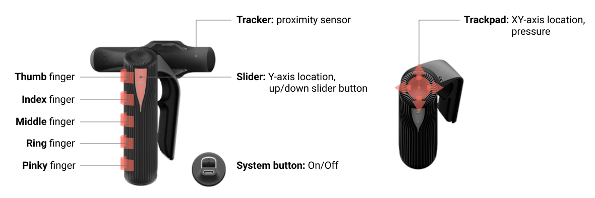
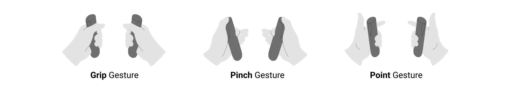

<!-- README file in MD for the etee Python API repository-->
<a name="readme-top"></a>
<!--
*** Attribution and thanks: README template adapted from Othneil Drew's example, available at:
*** https://github.com/othneildrew/Best-README-Template
-->


<!-- PROJECT LOGO -->
<br />


<p align="center">
   Official Python API for the eteeControllers.
   <br />
   <a href="https://tg0-etee-python-api.readthedocs-hosted.com/en/latest/index.html#"><strong>Explore the docs »</strong></a>
   <br />
   <a href="https://github.com/eteeXR/etee-Python-API/issues">Report Bug</a>
   ·
   <a href="https://github.com/eteeXR/etee-Python-API/issues">Request Feature</a>
</p>


<!-- SHIELDS FOR REPO -->
<br />
<p align="center">
    <a href="https://tg0-etee-python-api.readthedocs-hosted.com/en/latest/index.html#">
        </a>
    <a>
        </a>
    <a>
        </a>
</p>

<!-- SHIELDS FOR SOCIALS -->
<p align="center">
    <a href="https://eteexr.com/">
        </a>
    <a href="customer@eteexr.com">
        </a>
    <a href="https://twitter.com/etee_tg0">
        </a>
</p>


<!-- TABLE OF CONTENTS -->
<details>
  <summary>Table of Contents</summary>
  <ol>
    <li>
      <a href="#about-the-project">About The Project</a>
    </li>
    <li>
      <a href="#getting-started">Getting Started</a>
      <ul>
        <li><a href="#clone-repo">Step 1: Clone the Repository</a></li>
        <li><a href="#package-installation-and-venv">Step 2: Package Installation & Environment</a></li>
      </ul>
    </li>
    <li>
      <a href="#usage">Usage</a>
      <ul>
        <li><a href="#hardware-setup">Hardware Setup</a></li>
        <li><a href="#example-scripts">Example Scripts</a></li>
        <li><a href="#further-information">Further Information</a></li>
      </ul>
    </li>
    <li><a href="#contributing">Contributing</a>
      <ul>
        <li><a href="#how-to-contribute">How to Contribute</a></li>
        <li><a href="#semantic-type-prefixes">Semantic Type Prefixes</a></li>
      </ul>
    </li>
    <li><a href="#license">License</a></li>
    <li><a href="#authors">Authors</a></li>
    <li><a href="#contact">Contact</a></li>
  </ol>
</details>


<!-- ABOUT THE PROJECT -->
## About the Project

This API enables easy device data reading and communication.

In this repository, you can access:
- etee Python API package source code
- etee Python API example scripts
- Setup files

With this API, you will be able to retrieve a wide range of [data from the eteeControllers][url-documentation-data]:
* **Tactile data**: individual finger curling and pressure, trackpad, slider LED, tracker (connection, proximity sensor; no positional tracking) and system button. 

<p align="center">
  
  <br/>
  <em>Tactile and sensing data from the eteeController.</em>
</p>

* **Gestures**: grip, pinch and point gestures.

<p align="center">
  
  <br/>
  <em>Main eteeController gestures.</em>
</p>

* **Inertial Measuring Units (IMU) and 3D rotation**: raw 9-axis IMU data (accelerometer, gyroscope, magnetometer data) and 3D rotation estimations (quaternion, euler angles).
* **Device State**: right or left hand.
* **Battery State**: charge level, charge status.

For more information, please, visit our documentation site: 
[Developer Documentation - etee Python API][url-documentation]


<!-- GETTING STARTED -->
## Getting Started

<a name="clone-repo"></a>
### Step 1: Clone the repository

1. Open a command prompt.
2. Change the current working directory to the location where you want the cloned directory.
3. Type git clone, and then paste the URL for the Github repository.
    ```sh
    git clone https://github.com/eteeXR/etee-Python-API.git
    ```

<a name="package-installation-and-venv"></a>
### Step 2: Package Installation & Environment
This repository comes ready with two different setup files: 
- `setup_repo.py` will create a [virtual environment (venv)][url-python-venv] using the dependencies listed in `requirements.txt`.
- `setup.py` will automate the ***etee-api*** package installation.

> **Note:** You will need the pip package to run the installation. 
> If you do not have Python or pip installed, follow the 
> [Python guide on package installation][url-python-package-installation].


<a name="setting-up-venv"></a>
#### 2.1. Setting Up a Virtual Environment

> **If you do not want to run the example scripts**, please skip this step and move to: 
> <a href="#installing-the-package">2.2. Installing the Package</a>.

After cloning the repository, you will need to install all the project dependencies to run the example code.
Unlike *step 2.2*., these steps will install extra dependencies required only when running the example scripts 
(e.g. `keyboard`, `matplotlib`).

1. Open a command prompt.
2. Navigate to the directory where the `setup_repo.py` is located.
3. Run the script.
    ```sh
    python setup_repo.py
    ```
4. This should have created a venv inside your project directory. You can activate it at any time by navigating
to the directory containing the /venv folder and entering the following command line:
   ```sh
   .venv\Scripts\activate.bat
   ```

<a name="installing-the-package"></a>
#### 2.2. Installing the Package

You can automate the installation of the ***etee-api*** package and all its dependencies in 
your Python environment, by using the `setup.py` script. 

1. Open a command prompt. 
2. If you followed *step 2.1.*, make sure that you activate the venv (see previous section).
3. Navigate to the directory where the `setup.py` is located.
4. Use the pip method to run the installation file.
    ```sh
    pip install .
    ```
5. To check that the package has been successfully installed, you can run the pip list command.
    ```sh
    pip list
    ```
   If the package was installed, you will see its name and version listed:
    ```text
    Package         Version
    --------------- -------
    etee-api        1.0.0
    ```

<p align="right">(<a href="#readme-top">back to top</a>)</p>


<!-- USAGE EXAMPLES -->
## Usage

### Hardware Setup

To get started, [set up the hardware][url-documentation-setup-hw]. This involves connecting the eteeDongle to your 
PC or laptop, and turning ON the eteeControllers. You will know they are connected if the eteeDongle keeps blinking in 
the following pattern: pink-pink-blue.

### Example Scripts

If you followed the previous steps on installation, you should be able to run any example scripts.

1. Open a command prompt. 
2. In case you followed *step 2.1.*, make sure that you activate the venv.
3. Navigate to the directory where the example script is located. 
4. Use the python method to run the example script.
    ```sh
    python example_script_name.py
    ```

### Further Information
We also have [quickstart][url-documentation-quickstart] and [more detailed developer guides][url-documentation-api-functions]
in our documentation page. This might help you understand the different API functionalities and how to integrate them 
in your custom applications.

_To learn more about the API and the eteeController data, visit our [Developer Documentation Site][url-documentation]_

<a href="https://tg0-etee-python-api.readthedocs-hosted.com/en/latest/index.html#">
  
</a>

<p align="right">(<a href="#readme-top">back to top</a>)</p>


<!-- CONTRIBUTING -->
## Contributing

### How to Contribute

Contributions are what make the open source community such an amazing place to learn, inspire, and create. 
Any contributions you make are **greatly appreciated**.

If you have a suggestion that would make this better, please fork the repo and create a pull request. 
You can also simply open an issue to describe your suggestion or report a bug.

1. Fork the Project
2. Create your Feature Branch (`git checkout -b feature/AmazingFeature`)
3. Commit your Changes (`git commit -m 'Add some AmazingFeature'`)
4. Push to the Branch (`git push origin feature/AmazingFeature`)
5. Open a Pull Request

### Semantic Type Prefixes

To help us and the community easily identify the nature of your *commit* or *issue*, use **semantic type prefixes** 
to precede your message / title.

Some common type prefixes include:

- `feat`: A new feature for the user, not a new feature for a build script.
- `fix`: Bug fix for the user, not a fix for a build scripts.
- `enhanc`: Enhancement or improvement to existing feature.
- `perf`: Code improved in terms of processing performance.
- `refactor`: Refactoring production code (e.g. renaming a variable).
- `chore`: Changes to the build process or auxiliary tools and libraries.
- `docs`: Changes to documentation.
- `style`: Formatting, missing semicolons, etc. No code change.
- `vendor`: Update version for dependencies and other packages.
- `test`: Adding missing tests or refactoring tests. No production code change.

**Format**: `<type>(<scope>): <subject>`, where < scope > is optional.

For example, your commit message header might look like this:
```text
feat(imu): Implemented Euler angles estimation from quaternion
```

For more references and guides on semantic code messages, see:

- [How are you writing a commit message?][url-semantic-type-prefixes-1] - by Darkø Tasevski
- [Git Commit Msg][url-semantic-type-prefixes-2] - Karma by Friedel Ziegelmayer

<p align="right">(<a href="#readme-top">back to top</a>)</p>


<!-- LICENSE -->
## License

Distributed under the Apache 2.0 License. See `LICENSE.txt` for more information.

<p align="right">(<a href="#readme-top">back to top</a>)</p>


<!-- AUTHORS-->
## Authors

This repository was created by the [TG0][url-tg0-website] team, for the [etee][url-eteexr-website] brand.

Code and documentation authors include:
- **Dimitri Chikhladze** (API development and documentation)
- **Pilar Zhang Qiu** (API development, documentation and releases)

<p align="right">(<a href="#readme-top">back to top</a>)</p>


<!-- CONTACT -->
## Contact

For any queries or reports about the API, please use the [**Issues tab**][url-issues-tab] in this repository.
When possible, use an identifier to help us describe your query, report or request. 
See more at: <a href="#semantic-type-prefixes">Semantic Type Prefixes</a>.

For further support or queries, you can contact us:
- Support e-mail: [customer@eteexr.com](customer@eteexr.com)
- Support Form: [https://eteexr.com/pages/support-form](https://eteexr.com/pages/support-form)

<p align="right">(<a href="#readme-top">back to top</a>)</p>


<!-- MARKDOWN LINKS & IMAGES -->
<!-- https://www.markdownguide.org/basic-syntax/#reference-style-links -->
[url-documentation]: https://tg0-etee-python-api.readthedocs-hosted.com/en/latest/index.html#
[url-documentation-setup-hw]: https://tg0-etee-python-api.readthedocs-hosted.com/en/latest/setup.html
[url-documentation-quickstart]: https://tg0-etee-python-api.readthedocs-hosted.com/en/latest/quickstart.html
[url-documentation-api-functions]: https://tg0-etee-python-api.readthedocs-hosted.com/en/latest/guide.html
[url-documentation-data]: https://tg0-etee-python-api.readthedocs-hosted.com/en/latest/serial.html#etee-packet-elements
[url-issues-tab]: https://github.com/eteeXR/etee-Python-API/issues
[url-python-venv]: https://docs.python.org/3/tutorial/venv.html
[url-python-package-installation]: https://packaging.python.org/en/latest/tutorials/installing-packages/
[url-tg0-website]: https://tg0.co.uk/
[url-eteexr-website]: https://eteexr.com/
[url-semantic-type-prefixes-1]: https://dev.to/puritanic/how-are-you-writing-a-commit-message-1ih7
[url-semantic-type-prefixes-2]: http://karma-runner.github.io/1.0/dev/git-commit-msg.html
